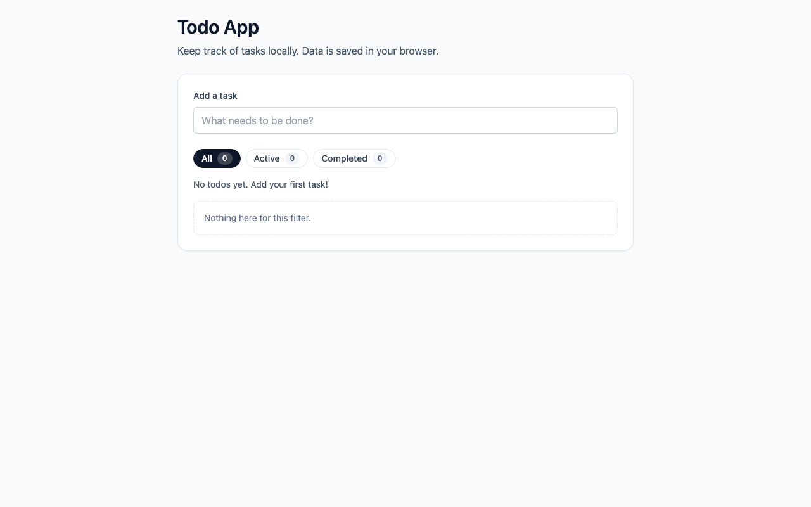

# Todo App (proj_6b5282c2)

A local-first Todo list built with Next.js 14, TypeScript, and Tailwind CSS. Todos persist in the browser via `localStorage`.

## 🚀 Live Demo

**Try it now:** https://proj6b5282c2.vercel.app



## Features
- Create, toggle, and delete todos
- Filter views: All / Active / Completed
- Local persistence across refreshes
- Responsive layout (mobile-first)

## Tech Stack
- Next.js 14 (App Router)
- TypeScript (strict mode)
- Tailwind CSS
- Vitest + React Testing Library

## Getting Started
```bash
npm install
npm run dev
```

Open [http://localhost:3000](http://localhost:3000).

## Scripts
- `npm run dev` — start dev server
- `npm run build` — production build
- `npm run start` — start production server
- `npm run lint` — ESLint checks
- `npm run typecheck` — TypeScript checks
- `npm run test` — run unit + integration tests

## Project Structure
```
src/
  app/
    layout.tsx
    page.tsx
  components/
    TodoApp.tsx
    TodoFilter.tsx
    TodoInput.tsx
    TodoItem.tsx
  lib/
    logger.ts
    storage.ts
  types/
    todo.ts

tests/
  integration/
    todo-app.test.tsx
  unit/
    storage.test.ts
  setup.ts
```

## Assumptions & TODOs
- **Assumption:** No backend or auth is required; persistence stays in `localStorage`.
- **TODO:** Replace this note with PRD/User Stories/API spec details once available.

## Setup Automation
```bash
./setup.sh
```

---

Generated by [OpenClaw Auto-Dev](https://github.com/openclaw/openclaw)
